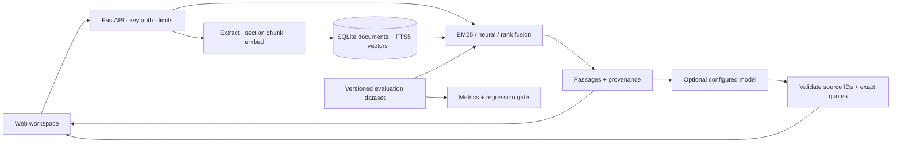

# DocAtlas

**Documentation answers with evidence you can inspect.**

DocAtlas ingests Markdown, text, HTML and text-based PDFs; searches with BM25,
local neural embeddings or hybrid rank fusion; and optionally synthesizes answers
through an OpenAI-compatible model. Every generated claim must reference a retrieved
passage and include a quote verified against that passage. The browser workspace
includes a document library, source inspection, retrieval comparison and system metrics.

## Measured, not assumed

A local development evaluation over **12 public FastAPI pages, 223 passages and 30
AI-authored questions** produced the following results at k=5:

| Method | Evidence recall@5 | MRR@5 | Out-of-corpus abstention |
|---|---:|---:|---:|
| BM25 | 0.9583 | 0.8090 | 1.0000 |
| Neural | 0.8750 | 0.7896 | 0.6667 |
| Hybrid | 0.9583 | 0.7986 | 0.6667 |

**Interpretation:** hybrid did not outperform BM25 on this small, terminology-heavy
development set. Neural retrieval reduced false abstentions on answerable questions,
but accepted two personal-data questions that the public corpus could not answer.
The default installation therefore starts with BM25; enable neural/hybrid explicitly
and evaluate it on your own corpus. See [full results](evals/development-results.md)
and [evaluation limitations](evals/README.md). These figures are not generated-answer
accuracy, a human-reviewed benchmark, or a production SLA.

## Run locally

Requires Python 3.11+ (3.12 is tested), SQLite with FTS5, and a modern browser.

```bash
git clone https://github.com/nymav/docatlas.git
cd docatlas
python3 -m venv .venv
source .venv/bin/activate
pip install -c requirements.lock '.[dev,semantic]'
docatlas serve
```

Open **http://127.0.0.1:8000**. Upload your documents in the library. The app works
without an API key in explicitly labeled evidence mode: it returns real retrieved
passages, not fabricated model responses.

For neural and hybrid retrieval, set `DOCATLAS_EMBEDDINGS=fastembed` before ingestion
and startup. The first ingestion downloads a small English ONNX embedding model;
later inference is local. Switching embedding models requires re-ingesting the corpus.

```bash
export DOCATLAS_EMBEDDINGS=fastembed
python scripts/fetch_corpus.py
docatlas ingest data/corpus --manifest data/corpus-sources.json
docatlas serve
```

The fetcher downloads only the public, revision-pinned FastAPI corpus and verifies
checksums. Its documentation may contain unexpanded upstream code-include directives;
the development questions target text passages rather than omitted source snippets.

## Connect a model

Configure a trusted OpenAI-compatible **chat-completions** endpoint that accepts
`response_format: {"type":"json_object"}`, `temperature`, and `max_tokens`:

```bash
export DOCATLAS_LLM_URL="http://127.0.0.1:11434/v1"
export DOCATLAS_LLM_MODEL="your-installed-model"
# For authenticated endpoints, set DOCATLAS_LLM_KEY in your shell or secret manager.
docatlas serve
```

The URL is the provider's base URL, without `/chat/completions`. A local Ollama server
is one option; it is not bundled or installed automatically. Remote providers receive
your question and selected passages. Model keys remain server-side. The browser's
workspace key is a separate key used to protect your DocAtlas instance.

No model credentials are included. Provider contracts, timeouts and citation rejection
are tested with mock HTTP responses; a live generation provider is not yet validated.

`.env.example` documents supported environment variables. The Python CLI reads the
process environment; it does **not** automatically load `.env`. Docker Compose does.

## Evaluate and prevent regressions

```bash
docatlas eval evals/fastapi-development.jsonl --modes bm25 dense hybrid --output data/report.json
docatlas eval evals/fastapi-development.jsonl --modes bm25 dense hybrid \
  --output data/candidate.json --baseline data/report.json --tolerance 0.01
pytest -q
ruff check src tests scripts
```

The evaluator writes JSON plus a readable Markdown report, per-category metrics and
failed cases. It fails on missing labels, incompatible datasets or regressed quality.
Tests prove a deliberately degraded report fails the gate. GitHub Actions runs unit
and API checks plus a container smoke test on pushes/PRs. A manually triggered public
corpus workflow runs the real embedding benchmark without paid model calls.

## Container deployment

```bash
cp .env.example .env
# Set DOCATLAS_API_KEY to a strong workspace secret in .env.
# Set DOCATLAS_EMBEDDINGS=fastembed if you want neural retrieval.
docker compose up --build -d
```

Compose publishes only on localhost and persists data/model weights in a named volume.
Enter the workspace key in the web app when prompted. The key is kept in tab memory,
not local storage. For a network deployment, use a TLS reverse proxy and set the key.
All holders of that key share one library and may add/delete documents. This is a
single-workspace service, not a multi-tenant SaaS identity system.

## Architecture and decisions



- **SQLite + exact vector search:** simple, persistent and inspectable for small
  libraries; every query currently scans candidate vectors. It is not designed for
  million-passage corpora. Move to an ANN index when measured scale requires it.
- **Atomic ingestion:** embedding succeeds before replacing the old document and
  both indexes in one transaction. Duplicate uploads are idempotent. Filename is
  document identity; two different documents need distinct filenames.
- **Constrained answers:** source membership and exact quotes are validated. This
  does not prove semantic entailment; a real quote can still support a misleading
  interpretation. No claim is made that prompt injection or hallucination is solved.
- **No silent simulation:** missing providers yield evidence-only results, failed
  generation yields a visible fallback, and unavailable neural retrieval returns an
  actionable error. No tool execution or external URL crawling is exposed.

See [operations](docs/OPERATIONS.md), [security](SECURITY.md), and the
[release acceptance criteria](docs/RELEASE_SCOPE.md).
